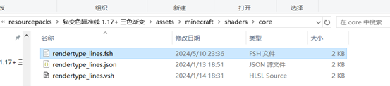
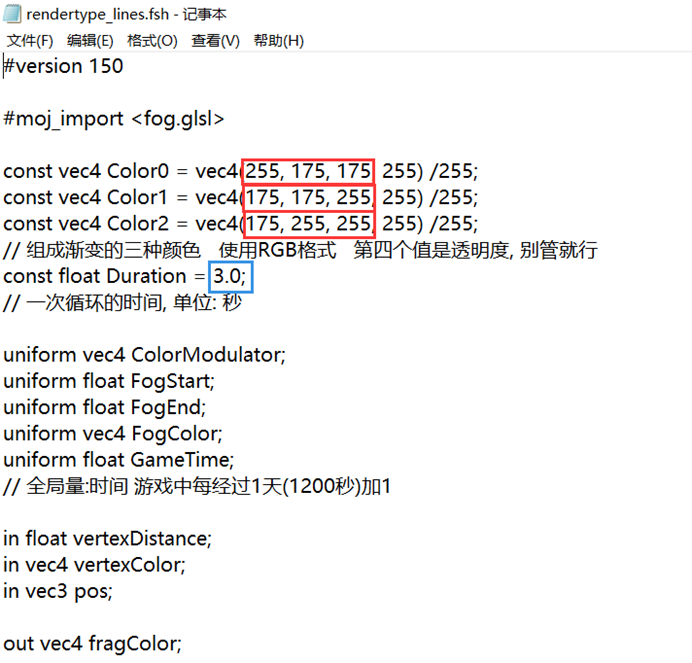
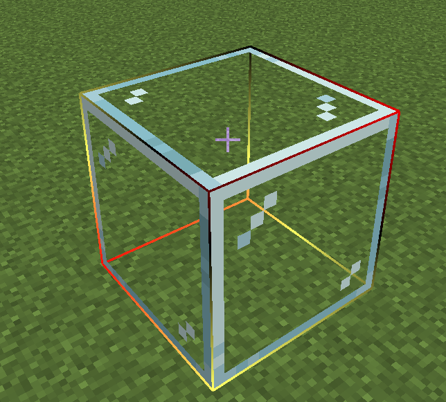
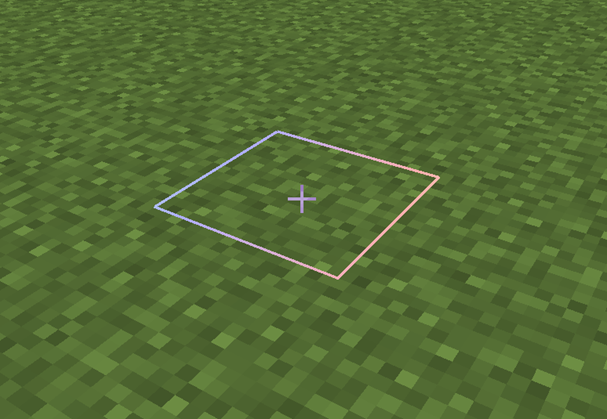
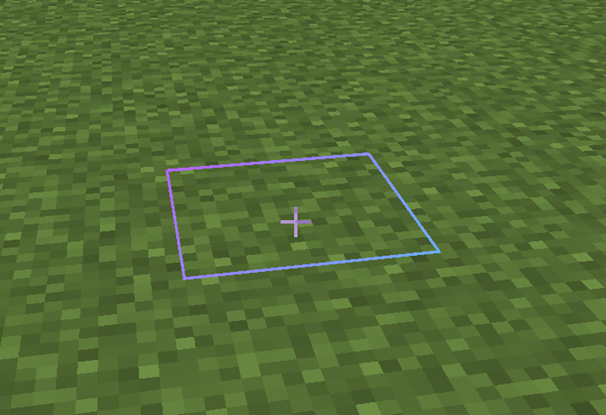

# 变色瞄准线

（闲的蛋疼写出来的东西）

提供给着色器初学者的一个示例着色器

**版本**: *1.17 - 1.21*

旧版本没有核心着色器所以用不了

## 安装

请将此文件所在的文件夹整个放到 `版本/resourcepacks` 路径下

并在游戏内加载该资源包

如果安装了像是 Optifine，钠，Iris 之类的影响渲染的 mod，可能**导致冲突**

## 自定义

`双色渐变瞄准线` 和 `三色渐变瞄准线` 提供了自定义操作

首先找到 `资源包\assets\minecraft\shaders\core\rendertype_lines.fsh` 文件

注意是 `.fsh` 结尾的文件，如果没有请勾选 `文件扩展名`



使用记事本打开（只要能编辑文本就行）

注意看红色和蓝色部分：



修改红色框内的数值可以改变**组成渐变的颜色**

修改蓝色框中的数值则可以改变**每次循环的时间**

例如填写

```glsl
const vec4 Color0 = vec4(0, 0, 0, 255) /255; 
```

可以使第0个颜色变成**黑色**

而填写

```glsl
const vec4 Color1 = vec4(255, 0, 0, 255) /255; 
```

可以使第1个颜色变成**纯红色**

填写

```glsl
const vec4 Color2 = vec4(255, 255, 100, 255) /255; 
```

可以使第2个颜色变成**淡黄色**

组合起来的效果就是这样的:



不太好看...

下面是两个还算好看的示例：

淡红 淡蓝 淡绿

```glsl
const vec4 Color0 = vec4(255, 175, 175, 255) /255; 
const vec4 Color1 = vec4(175, 255, 175, 255) /255; 
const vec4 Color2 = vec4(175, 175, 255, 255) /255;
```

效果：



淡蓝 淡紫

```glsl
const vec4 Color0 = vec4(80, 200, 255, 255) /255; 
const vec4 Color1 = vec4(200, 80, 255, 255) /255;
```

效果：

